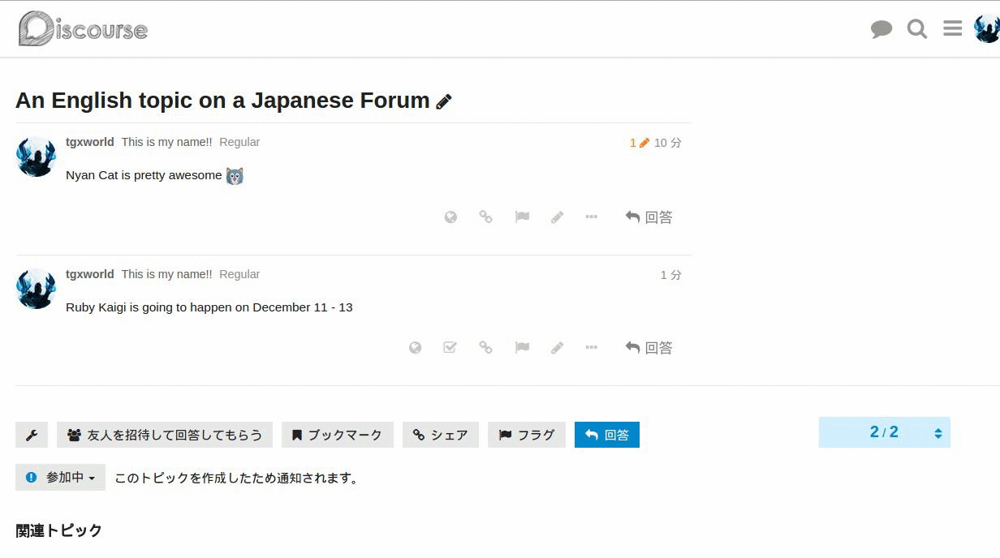
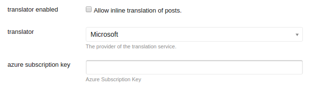

# discourse-translator

## Translation Services Supported
* [Microsoft Translator](http://www.microsoft.com/en-us/translator/default.aspx)
* [Google Translate - Comming Soon](https://cloud.google.com/translate/)

## Installation

https://meta.discourse.org/t/install-a-plugin/19157

## Setup

### Microsoft

1. Subscribe to the [Microsoft Translator API on Azure Marketplace](https://datamarket.azure.com/dataset/1899a118-d202-492c-aa16-ba21c33c06cb). Basic subscriptions, up to 2 million characters a month, are free. Translating more than 2 million characters per month requires a payment. You may pick from any of the available subscription offers.

2. Register your application Azure DataMarket
To register your application with Azure DataMarket, visit https://datamarket.azure.com/developer/applications/ using the LiveID credentials from step 1, and click on “Register”. In the “Register your application” dialog box, you can define your own Client ID and Name. The redirect URI is not used for the Microsoft Translator API. However, the redirect URI field is a mandatory field, and you must provide a URI to obtain the access code. A description is optional. Take a note of the client ID and the client secret value.

3. Under Admin > Settings > Plugins, enter the Client ID and Client Secret that you've obtained from the steps above.

4. Under Admin > Settings > Basic Setup, enable allow user locale.

## Known Issues
* Does not work well with [discourse-solved plugin](https://github.com/discourse/discourse-solved).
* Images are enlarged upon translating.

## TODOS
* Allow admin to set quote and disable translation once quota has been exceeded.
* Google Translate Adapter
